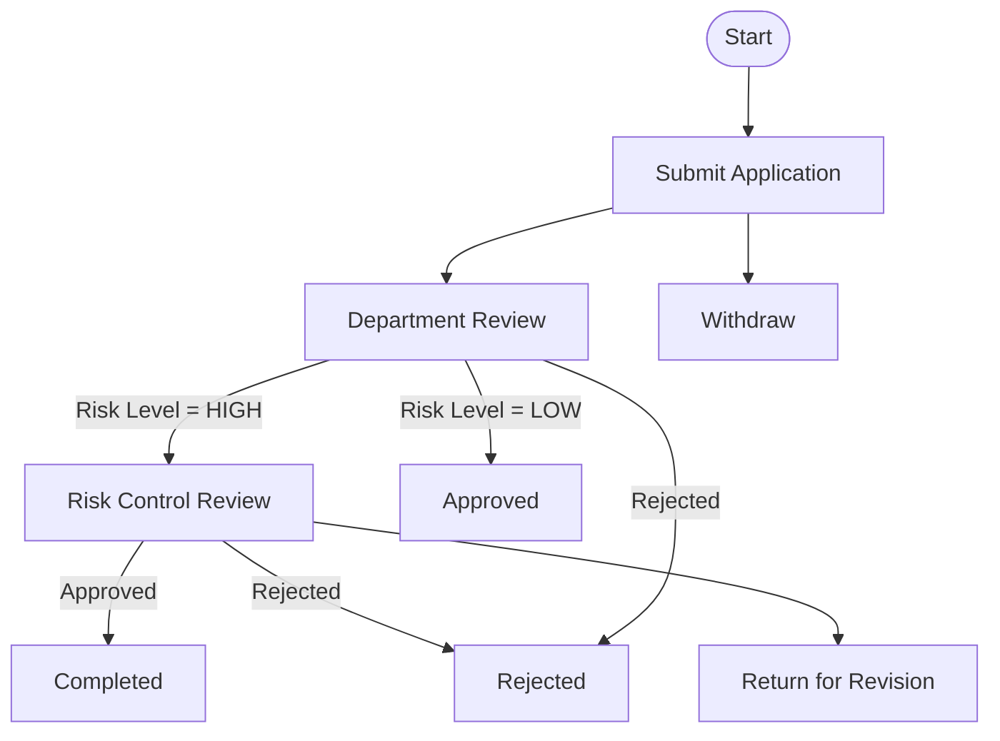

# Supply Chain - Financing Application Approval Process

## Process Overview

This document describes the financing application approval process for the supply chain system.

## Business Flow

## Actors

| Role | Description | Permissions |
|------|-------------|------------|
| applicant | Application submitter | Submit, Withdraw |
| department_manager | Department head | Approve, Reject, Transfer |
| risk_control_officer | Risk assessment specialist | Approve, Reject, Return |
| finance_officer | Finance department | View, Counter-sign |

## Business Rules

### R001: High Risk Approval Required
Suppliers with registered capital < 1,000,000 or risk level = HIGH require risk control officer approval.

### R002: Amount Threshold
Applications > 5,000,000 require finance officer counter-sign.

### R003: Auto-approve Low Risk
Low-risk applications with complete documentation are auto-approved after department review.

## Data Effects

| Field | Effect | Table |
|-------|--------|-------|
| status | APPROVED/REJECTED/WITHDRAWN | supplier |
| review_result | PASS/FAIL | supplier_risk_record |
| approved_amount | Final amount | supplier_contract |
